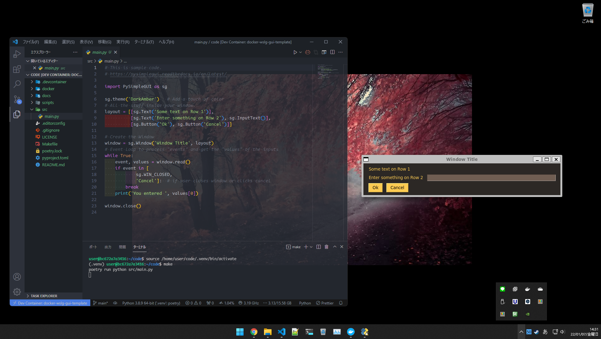

# Docker + WSLg GUI-Template

[English](../../../README.md) | 日本語

## 概要

<p align="center">
    
</p>

Docker + WSLg + devcontainer.json + Pythonのテンプレートです。

サンプルはpythonですが、他のイメージでも可能です。

## 目次

- [Docker + WSLg GUI-Template](#docker--wslg-gui-template)
  - [概要](#概要)
  - [目次](#目次)
  - [クイックスタート](#クイックスタート)
  - [前提条件](#前提条件)
  - [Make の使い方](#make-の使い方)
  - [ディレクトリ構造](#ディレクトリ構造)
  - [ライセンス](#ライセンス)

## クイックスタート

<font color=red>警告:</font> **必ずWSLのディレクトリ内で実行**してください。
でないと正しくwslgディレクトリが正しくマウントされず、GUIが表示できません。

Run the following command.

```bash
git clone
```

## 前提条件

必須

- Windows 11 (WSLgのため)
- [WSLg](https://github.com/microsoft/wslg)

  (WindowsでDockerのGUIを表示するために必要)

- [Docker Desktop for Windows](https://hub.docker.com/editions/community/docker-ce-desktop-windows)
  (仮想コンテナーによる任意の環境構築のため）

任意

- [VS Code](https://azure.microsoft.com/ja-jp/products/visual-studio-code/?cdn=disable)
  (開発しやすくするために)
  - 拡張機能
    [Remote Development](https://marketplace.visualstudio.com/items?itemName=ms-vscode-remote.vscode-remote-extensionpack)

## Make の使い方

| コマンド                | 説明                                          |
| :------------------ | :------------------------------------------ |
| `make compose-conf` | `.env.wsl`を設定し、 `docker-compose.yml` の設定を表示 |
| `make compose-up`   | `docker-compose.yml` によってコンテナーを作成           |
| `make start`        | pythonファイル(デフォルト: `src/main.py`) を実行        |
| `make install-dev`  | 依存関係のインストール(開発用)                            |
| `make install`      | 依存関係のインストール (本番用)                           |
| `make test`         | pytestでテスト実行                                |
| `make lint`         | pysenを使ったLint                               |
| `make lint-fix`     | pysenを使ったコードの自動整形と修正                        |
| `make clean`        | `__pycache__` ファイル、`.venv`ディレクトリを削除         |

`Windows`をお使いの場合、[こちら](http://gnuwin32.sourceforge.net/packages/make.htm)から`make`コマンドをインストールできます。(`setup`ボタンをクリックします)

## ディレクトリ構造

```bash
docker-wslg-gui-template
├── .devcontainer
|  └── devcontainer.json
├── .editorconfig
├── .github
|  └── workflows
|     └── ci.yml
├── docker
|  ├── .env.wslg
|  ├── Dockerfile
|  └── docker-compose.yml
├── docs
|  ├── i18n
|  |  └── jp
|  └── images
|     └── gui-sample.png
├── scripts
|  └── set-wslg.sh
├── src
|  ├── main.py
|  └── utils
|     ├── __init__.py
|     └── operator.py
├── tests
|  ├── __init__.py
|  └── test_operator.py
├── .gitignore
├── LICENSE
├── Makefile
├── poetry.lock
├── pyproject.toml
└── README.md
```

## ライセンス

[Unlicense](https://unlicense.org/)
