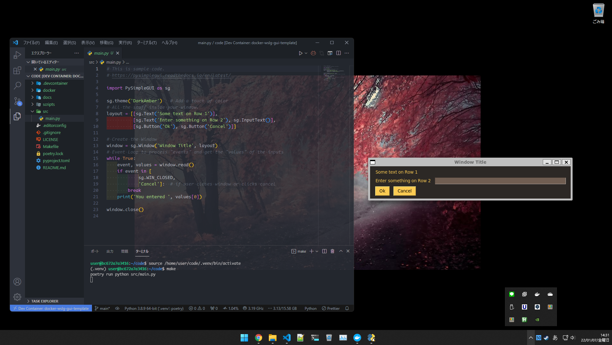
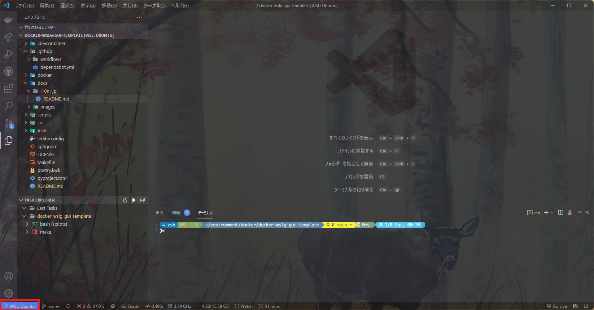
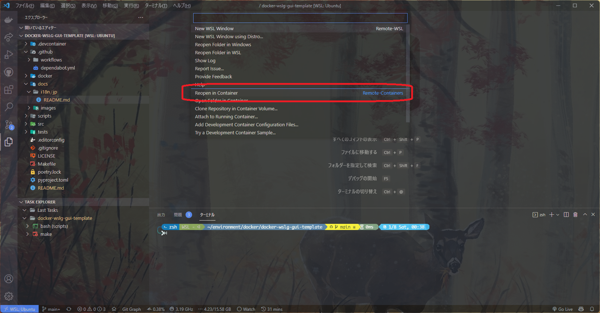

# Docker + WSLg GUI-Template

English | [日本語](./docs/i18n/jp/readme.md)

## About

<p align="center">
    
</p>

This is Docker + WSLg + devcontainer.json + Python template.

The sample is in python, but other images are also possible.

## Table of Contents

- [Docker + WSLg GUI-Template](#docker--wslg-gui-template)
  - [About](#about)
  - [Table of Contents](#table-of-contents)
  - [Prerequisites](#prerequisites)
  - [Quick Start](#quick-start)
    - [If you are using an editor other than VS code](#if-you-are-using-an-editor-other-than-vs-code)
    - [VS code User](#vs-code-user)
  - [Make usage](#make-usage)
  - [Directory structure](#directory-structure)
  - [License](#license)

## Prerequisites

Required

- Windows 11 (for WSLg)
- [WSLg](https://github.com/microsoft/wslg)

  (Required to display Docker GUI on windows)

- git

- [Docker Desktop for Windows](https://hub.docker.com/editions/community/docker-ce-desktop-windows)
  (Build any environment with virtual containers)

Optional

- [VS Code](https://azure.microsoft.com/ja-jp/products/visual-studio-code/?cdn=disable)
  (for easier development)
  - Extension
    [Remote Development](https://marketplace.visualstudio.com/items?itemName=ms-vscode-remote.vscode-remote-extensionpack)

## Quick Start

<font color=red>Warning:</font> **Be sure to run it in the WSL directory.**
Otherwise, the wslg directory will not be mounted correctly and the GUI will not
be displayed.

---

### If you are using an editor other than VS code

Step 1: Run the following command.

```bash
git clone https://github.com/SARDONYX-sard/docker-wslg-gui-template.git
cd docker-wslg-gui-template
```

Step2: Enter the following command and then enter the container created.

```bash
make compose
```

---

### VS code User

Step 1: Run the following command.

```bash
git clone https://github.com/SARDONYX-sard/docker-wslg-gui-template.git
cd docker-wslg-gui-template
code .
```

Step 2: Click on the WSL: `<Linux name>` icon in the lower left corner.

<p align="center">
    
</p>

Step 3: Select the item `Reopen in Container` from the palette that appears in
the center.

<p align="center">
    
</p>

## Make usage

| Command             | Description                                       |
| :------------------ | :------------------------------------------------ |
| `make compose-conf` | Set `.env.wsl` & Show `docker-compose.yml` config |
| `make compose`      | Create container by `docker-compose.yml`          |
| `make start`        | Run python file(default: `src/main.py`)           |
| `make install-dev`  | Install dependencies (For dev)                    |
| `make install`      | Install dependencies (For prod)                   |
| `make lint`         | Lint with pysen                                   |
| `make lint-fix`     | Lint fix with pysen                               |
| `make test`         | Test with pytest                                  |
| `make ci`           | Remove `.venv` dir & Install dependencies         |
| `make clean`        | Remove cache files                                |

If you are using windows, you can install the `make` command
[here](http://gnuwin32.sourceforge.net/packages/make.htm).

(Click the `Setup` button at the top.)

## Directory structure

```bash
docker-wslg-gui-template
├── .devcontainer
|  └── devcontainer.json
├── .editorconfig
├── .github
|  ├── dependabot.yml
|  └── workflows
|     └── ci.yml
├── docker
|  ├── .env.wslg
|  ├── Dockerfile
|  └── docker-compose.yml
├── docs
|  ├── i18n
|  |  └── jp
|  └── images
|     └── gui-sample.png
├── scripts
|  └── set-wslg.sh
├── src
|  ├── main.py
|  └── utils
|     ├── __init__.py
|     └── operator.py
├── tests
|  ├── __init__.py
|  └── test_operator.py
├── .gitignore
├── LICENSE
├── Makefile
├── poetry.lock
├── pyproject.toml
└── README.md
```

## License

[Unlicense](https://unlicense.org/)
